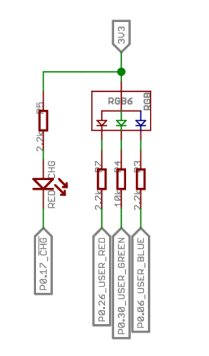

<h1> nrf52840_openWSN_sensor_node</h1></br>

- [Project Overview](#Project-Overview)

  - [Current Hardware Status](#Current-Hardware-Status)

- [Guide for OpenWSN on XIAO-nrf52840](#Guide-for-OpenWSN-on-XIAO-nrf52840)

  - [ART communication with openWSB on XIAO-nrf5280](#UART-communication-with-openWSB-on-XIAO-nrf5280)

  - [ADC Driver for nRF52 SAADC XIAO nRF52840](#ADC-Driver-for-nRF52-SAADC-XIAO-nRF52840)

  - [OpenWSN ADC Reader Application](#OpenWSN-ADC-Reader-Application)

</br>

---
<h1>Project Overview</h1>
The project's aim is to create a wireless acoustic sensor network using the <a href="https://wiki.seeedstudio.com/XIAO_BLE/">XIAO-nrf52840</a> and <a href="https://openwsn.org/">openWSN</a>. Acoustic signals are captured and processed by a <a href="https://www.pjrc.com/store/teensy40.html">Teensy4.0</a> in conjunction with the <a href="https://www.pjrc.com/store/teensy3_audio.html">Teensy Audio Adaptor Board</a>. These samples are saved to a removable SD card. The output of that processing is passed through the wireless network to a central "root" device. This root node does not perform sensing; instead, it passes the information to an LTE-M modem, which then uses MQTTto send the processed data to a cloud storage solution. 
</br>
</br>

This project builds upon the foundation of the <a href="https://github.com/mmontee/West_Lab_Hydrophone_Data_Logger">"West_Lab_Hydrophone_Data_Logger"</a>. The initial objective was to integrate the nrf52840 into the existing hardware architecture. The longer-term goal is to migrate the signal processing tasks currently handled by the Teensy 4.0 onto the nrf52840. This consolidation of processing onto a single mote should yield significant power savings while also decreasing the complexity, size, and hardware cost of each sensor node. Currently the existing system relies on the Teensy Audio Adaptor Board for audio signal acquisition. A critical aspect of this transition will be to incorporate appropriate signal conditioning hardware. 

<p align="center">

</p>

<h3>Current Software Status</h3>

Complete:
* <strong>Modified Openserial Driver</strong>: The openserial driver has been adapted to enable UART communication between the Teensy and the nrf52840.
* <strong>ADC Driver</strong>: A dedicated ADC driver has been developed.
* <strong>ADC Application</strong>: A sample application has been created to demonstrate the functionality of the ADC driver. This application also serves as a foundation for implementing more advanced signal processing capabilities.


Incomplete:
* <strong>Signal capture and processing on nrf52840</strong>: Expand ADC application to capture a time series of samples and subsequently process them. 

<h3>Current Hardware Status</h3>
Complete:

* Every node consists for a custom PCB that interfaces the XIAO-nrf52840, Teensy boards, RTC bettery, battery management board, and various I/O. </br>


<p align="center">

</p>

* A root node adds an LTE-M modem in the form of a [Sequans communications Monarch 2 GM02SP Evaluation Kit](https://sequans.com/products/monarch-2-gm02sp-nektar-evk/) that is used to send data to a cental location.

<p align="center">

</p>

* Shown below is the  "West_Lab_Hydrophone_Data_Logger" PCB modified to include the XIAO nrf52840.

<p align="center">

</p>
Incomplete:

* New PCB revision that incorporates appropriate signal conditioning hardware and removes the teensy4.0 and audio adapter board.


---
</br>
</br>
<h2>Guide for OpenWSN on XIAO-nrf52840</h2>

Luckily the work has been done through openWSN's nrf52840-DK implementation that can be found [here](https://github.com/openwsn-berkeley/openwsn-fw/tree/develop_FW-893). </br>

In this project the [nrf52840-DK](https://www.nordicsemi.com/Products/Development-hardware/nRF52840-DK) is used to provide a method for programming and debugging the XIAO-nrf5280 dev board.</br>

This guide will step through the processes of:
* Configuring the existing work for a new set of pins
* How to use the nrf52840-DK to program/de-bug the XIAO-nrf52840
* How to use UART connections to get information in and out of openWSN.

For this guide you are expected to have: </br>
* XIAO-nrf52840 Development board </br>
* Nordic Semi nrf52840-DK </br>
* [SEEED STUDIO EXPANSION BASE XIAO](https://wiki.seeedstudio.com/Seeeduino-XIAO-Expansion-Board/) or the ability to solder small jumper wires to the XIAO-nrf52840 </br>

---
</br>
</br>

<h3>Software Set-up</h3>

1. Install Segger Embedded Studio for ARM (legacy) V6.30.</br>

 https://www.segger.com/downloads/embedded-studio/#ESforARM </br>


<p align="center">

</p>


2.  Clone the openWSN openwsn-fw : https://github.com/openwsn-berkeley/openwsn-fw</br> 

3.  Switch to the branch - "develop_FW-893" </br>
<p align="center">

</p>


4. Navigate to the folder

```openwsn-fw/projects/nrf52840-DK/```

5. Open the projet file </br>

```nrf52840_dk.emProject```

The project should be opened by the Segger Embedded Studio installed in a previous step.</br>

<p align="center">

</p>

</br>
</br>

---
</br>
</br>

<h3>Connecting to the XIAO-nrf5280 to the nrf5280-DK</h3>

Programming is done through JTAG/SWD interface on the nrf52840-DK called "J-Link". 
* Both boards must share a ground reference
* Power must be provided to both(in our example the nrf52840-DK powers the XIAO-nrf5280) 
* Connect SWD CLK
* Connect SWD IO
* Connect Jumper

Below the connection are illustrated.
<p align="center">

</p>

We accomplished created the necessary connetions using two methods. </br>
1. The first using a "Expansion Board Base for XIAO". This board provides pogo pin contacts for the XIAO-nrf5280's SWD pads. </br>

<p align="center">

</p>
</br>
</br>

2. Alternativly wire leads can be soldered to the XIAO-nrf5280's SWD pads. The wire leads can then be direclty connected to the nrf52850-DK as shown below.
<p align="center">

</p>

---
</br>
</br>

<h3>Modifying openWSN for the XIAO-nrf5280</h3>

Two changes are made to the branch to configure for the XIAO-nrf5280 platform. The UART and LED pin assignments need to be changed. 

1.  The UART pin assignments are found /bsp/uart.c. The below image shows the collect vales for the XIAO-nrf5280. </br>

<p align="center">

</p>

2.  The LED pins need to be changed in /bsp/led.c. The below image shows the collect vales for the XIAO-nrf5280. </br>

<p align="center">

</p>

Reference schematic for LED assignment</br>

<p align="center">

</p>

---
</br>
</br>

<h3>Programming the XIAO-nrf5280</h3>

Assuming the necessary connections are establised between the XIAO-nrf5280 and the nrf5280-DK

Set openWSN as the active project by left clicking the project name withing the "Project Explorer"

<p align="center">

</p>

Compile -> Build-Build 03oos_openwsn</br>

<p align="center">

</p>


Program -> Target - Connect J-Link, Then Target - Download 03oos_openwsn</br>

<p align="center">

</p>

---
</br>
</br>

<h2>Guide for UART communication with openWSB on XIAO-nrf5280</h2>

This project modifies openserial.c to execute functions as UART messages are received. Nodes receive processed signal information and pass all data to the root node. The root node's UART output is parsed using a Teensy. </br>

In coming UART messages are parsed within openserial.c using a set of flags found in ```openhdlc.h``` and command characters named 'cmdByte' that are defined in ```openserial.h``` are shown below. </br>

<p align="center">
Flags</br>

</p>

<p align="center">
cmdBytes</br>

</p>

Valid messages are be proceeded by a HDLC_FLAG and begin with a valid flag, followed by the cmdByte, then the payload, and terminated with a second HDLC_FLAG</br> 

A message coming into openserial should have the form.</br>
```<HDLC_FLAG><cmdByte><payload><HDLC_FLAG> ```</br>

We send information into the node using the following form where ```'~'``` is the HDLC_FLAG, ```'D'``` as the cmdByte and ```'1234567890'``` is example information.</br>
EX. ```~D1234567890~```

After a valid message is parsed it is passed to a switch that acts on the received cmdByte. This byte will index a certain action. Below we pass the incoming data as that action or do nothing if we are root. </br>

<p align="center">

</p>

Once that data is in the data bus it can be read my the uniject app that will create a UDP packet containing the data that will be passed over the network.  


<h2> ADC Driver for nRF52 SAADC (XIAO nRF52840)</h2>


<h2>1. Overview</h2>

This document describes a low-level driver for the nRF52 Successive-Approximation Analog-to-Digital Converter (SAADC) peripheral. The driver is designed for simplicity and ease of use, providing a blocking (synchronous) API for single-channel ADC conversions.

It is specifically tailored with pin definitions corresponding to the analog pins on the **Seeed Studio XIAO nRF52840** board but can be adapted for other nRF52-based hardware.

<h3>Key Features</h3>

* **Easy Configuration:** Uses a single configuration structure (`adc_config_t`) to set all major parameters.
* **Blocking Sampling:** The `adc_sample()` function waits for the conversion to complete before returning, simplifying application logic.
* **Hardware Abstraction:** Maps XIAO nRF52840 pin names (A0-A5) to the correct nRF52 AIN inputs.
* **Configurable Parameters:**
    * Resolution (8, 10, 12, 14-bit)
    * Hardware Oversampling (up to 256x)
    * Reference Voltage (Internal 0.6V or VDD/4)
    * Input Gain (1/6x to 4x)
    * Acquisition Time (3µs to 40µs)
* **Automatic Calibration:** Performs an automatic offset calibration during initialization to improve accuracy.

---

<h2>2. API Reference</h2>

The driver exposes three main functions for controlling the ADC.

<h3><code>void adc_init(const adc_config_t* config)</code></h3>

Initializes the SAADC peripheral with the specified settings. This function must be called before any sampling can occur.

* **Description:** Configures the ADC resolution, oversampling, channel settings (pin, gain, reference, acquisition time), performs an offset calibration, and enables the peripheral.
* **Parameters:**
    * `config`: A pointer to a constant `adc_config_t` structure containing the desired ADC settings.

<h3><code>bool adc_sample(uint16_t* result)</code></h3>

Performs a single, blocking ADC conversion on the channel configured during initialization.

* **Description:** This function starts the ADC, triggers a sample, and waits for the `EVENTS_END` interrupt flag. It then copies the conversion result from the internal buffer to the user-provided location. To save power, it stops the ADC after the sample is complete.
* **Warning:** This function blocks program execution until the conversion is complete.
* **Parameters:**
    * `result`: A pointer to a `uint16_t` variable where the ADC conversion result will be stored. The value's range depends on the configured resolution (e.g., 0-1023 for 10-bit).
* **Returns:**
    * `true`: If the conversion was successful.
    * `false`: If the ADC was not initialized or the `result` pointer is NULL.

<h3><code>void adc_uninit(void)</code></h3>

Disables and powers down the SAADC peripheral to save energy.

* **Description:** Stops any ongoing conversions, disables the peripheral, and resets channel configurations. An `adc_init()` call is required before any new samples can be taken.

---

<h2>3. Configuration</h2>

Configuration is handled via the `adc_config_t` struct and several `enum` types.

<h3><code>adc_config_t</code> Structure</h3>

This structure holds all the necessary parameters for the `adc_init` function.

```c
typedef struct {
    adc_resolution_t       resolution;
    adc_oversample_t       oversample;
    adc_reference_t        reference;
    adc_gain_t             gain;
    adc_acqtime_t          acq_time;
    adc_analog_input_pin_t pin;
} adc_config_t;
```

<h3>Configuration Enums</h3>

<h4><code>adc_analog_input_pin_t</code></h4>

Selects the physical analog input pin on the XIAO nRF52840.

| Enum Value   | XIAO Pin | nRF2 Pin | nRF52 AIN |
| :----------- | :------- | :-------- | :-------- |
| `ADC_PIN_A0` | A0       | P0.02     | AIN0      |
| `ADC_PIN_A1` | A1       | P0.03     | AIN1      |
| `ADC_PIN_A2` | A2       | P0.28     | AIN4      |
| `ADC_PIN_A3` | A3       | P0.29     | AIN5      |
| `ADC_PIN_A4` | A4       | P0.04     | AIN2      |
| `ADC_PIN_A5` | A5       | P0.05     | AIN3      |

<h4><code>adc_resolution_t</code></h4>

Sets the bit resolution of the conversion. Higher resolution provides more precision but takes longer.

* `ADC_RESOLUTION_8BIT`
* `ADC_RESOLUTION_10BIT` (Common default)
* `ADC_RESOLUTION_12BIT`
* `ADC_RESOLUTION_14BIT` (Requires acquisition time >= 10µs)

<h4><code>adc_oversample_t</code></h4>

Enables hardware averaging to reduce noise. The ADC takes multiple samples and averages them into a single result.

* `ADC_OVERSAMPLE_DISABLED`
* `ADC_OVERSAMPLE_2X`, `_4X`, `_8X`, `_16X`, `_32X`, `_64X`, `_128X`, `_256X`

<h4><code>adc_reference_t</code></h4>

Selects the voltage reference for the conversion.

* `ADC_REFERENCE_INTERNAL`: Internal 0.6V reference.
* `ADC_REFERENCE_VDD_DIV_4`: Uses VDD / 4 as the reference.

<h4><code>adc_gain_t</code></h4>

Sets the gain for the internal pre-amplifier. The total input voltage range is determined by `V_Reference / Gain`.

| Enum Value     | Gain | Input Range (with 0.6V VREF) | Input Range (with VDD/4 VREF)       |
| :------------- | :--- | :--------------------------- | :---------------------------------- |
| `ADC_GAIN_1_6` | 1/6x | 0 - 3.6V                     | 0 - 6.0V (if VDD=3.3V -> 0-4.95V)   |
| `ADC_GAIN_1_5` | 1/5x | 0 - 3.0V                     | 0 - 5.0V (if VDD=3.3V -> 0-4.125V)  |
| `ADC_GAIN_1_4` | 1/4x | 0 - 2.4V                     | 0 - 4.0V (if VDD=3.3V -> 0-3.3V)    |
| `ADC_GAIN_1_3` | 1/3x | 0 - 1.8V                     | 0 - 3.0V (if VDD=3.3V -> 0-2.475V)  |
| `ADC_GAIN_1_2` | 1/2x | 0 - 1.2V                     | 0 - 2.0V (if VDD=3.3V -> 0-1.65V)   |
| `ADC_GAIN_1`   | 1x   | 0 - 0.6V                     | 0 - 1.0V (if VDD=3.3V -> 0-0.825V)  |
| `ADC_GAIN_2`   | 2x   | 0 - 0.3V                     | 0 - 0.5V (if VDD=3.3V -> 0-0.4125V) |
| `ADC_GAIN_4`   | 4x   | 0 - 0.15V                    | 0 - 0.25V (if VDD=3.3V -> 0-0.206V) |

**Note:** The actual input range is limited by VDD. For example, with `ADC_GAIN_1_6` and VDD at 3.3V, the effective range is 0V to 3.3V, even though the theoretical range is higher. **The most common setting for measuring a voltage from 0 to VDD (3.3V) is to use `ADC_REFERENCE_INTERNAL` and `ADC_GAIN_1_6`.**

<h4><code>adc_acqtime_t</code></h4>

Sets the acquisition time for the sample-and-hold capacitor. Longer times are needed for high-impedance sources.

* `ADC_ACQTIME_3US`
* `ADC_ACQTIME_5US`
* `ADC_ACQTIME_10US`
* `ADC_ACQTIME_15US`
* `ADC_ACQTIME_20US`
* `ADC_ACQTIME_40US`

---

<h2>4. Usage Example</h2>

Here is a complete example of how to initialize, configure, and read from an analog pin.

```c
#include "adc.h"
#include <stdio.h> // For printing

int main(void) {
    // 1. Configure the ADC
    // This example configures the ADC to read a voltage between 0-3.3V
    // on pin A0 with 10-bit resolution.
    const adc_config_t my_adc_config = {
        .resolution = ADC_RESOLUTION_10BIT,
        .oversample = ADC_OVERSAMPLE_4X,      // Use 4x oversampling for better stability
        .reference  = ADC_REFERENCE_INTERNAL, // Use internal 0.6V reference
        .gain       = ADC_GAIN_1_6,           // Use 1/6 gain (effective input range is 0.6V * 6 = 3.6V)
        .acq_time   = ADC_ACQTIME_10US,
        .pin        = ADC_PIN_A0
    };

    // 2. Initialize the ADC
    adc_init(&my_adc_config);

    // 3. Main loop to sample the ADC
    while (1) {
        uint16_t adc_raw_value;

        // Take a sample
        if (adc_sample(&adc_raw_value)) {
            // Success! `adc_raw_value` contains the result (e.g., 0-1023 for 10-bit)

            // Optional: Convert raw value to millivolts
            // V_in = (RawValue / 2^Resolution) * V_Reference / Gain
            // V_in_mV = (adc_raw_value / 1024.0) * (600.0 / (1.0/6.0))
            // V_in_mV = (adc_raw_value / 1024.0) * 3600.0
            float voltage_mv = (float)adc_raw_value * (3600.0f / 1024.0f);

            // Print the result (assuming a UART or RTT is set up)
            printf("ADC Raw: %u, Voltage: %.2f mV\n", adc_raw_value, (double)voltage_mv);

        } else {
            // Handle error (e.g., ADC not initialized)
            printf("ADC sample failed.\n");
        }

        // Delay between samples
        for (volatile int i = 0; i < 1000000; i++);
    }

    // 4. Uninitialize (optional, typically not reached in a main loop)
    // adc_uninit();
}
```


<h1>OpenWSN ADC Reader Application</h1>

<h2>1. Overview</h2>

This document describes `adcread`, a simple application component for the OpenWSN operating system. Its purpose is to periodically read an analog sensor using the `adc` driver and make the latest reading available to other parts of the system.

The application integrates with the OpenWSN kernel's `opentimers` service to schedule non-blocking, periodic ADC sampling. This makes it an efficient, low-power way to monitor a sensor.

<h3>Key Features</h3>

* **OpenWSN Integration:** Built as a standard OpenWSN component that uses the kernel's timer service for scheduling.
* **Periodic Sampling:** Automatically reads the configured ADC channel every 5 seconds (`ADC_READER_PERIOD_MS`).
* **Non-blocking API:** Provides a simple, non-blocking function (`adcread_get_value()`) for other modules to retrieve the latest sensor data.
* **Power Efficient:** Does not run on the DAGroot to save energy on the most critical node in the network.
* **Driver Abstraction:** Uses the underlying `adc` peripheral driver, separating the application logic from the hardware-specific details.

---

<h2>2. API Reference</h2>

The `adcread` application exposes two public functions.

<h3><code>void adcread_init(void)</code></h3>

Initializes the ADC reader application.

* **Description:** This function configures and initializes the underlying `adc` driver with static settings defined within `adcread.c`. It then creates and schedules a periodic timer that will trigger an ADC reading.
* **Warning:** This function must be called *after* `opentimers_init()` has been successfully executed.

<h3><code>uint16_t adcread_get_value(void)</code></h3>

Retrieves the last raw ADC value that was measured.

* **Description:** This is a non-blocking function that immediately returns the most recent ADC value stored by the periodic timer task. It does not trigger a new ADC reading.
* **Returns:** A `uint16_t` representing the latest raw ADC conversion result.

---

<h2>3. Configuration</h2>

Unlike the driver, the application's configuration is hard-coded within the `adcread.c` file for simplicity. To change these settings, you must edit the source file and recompile.

<h3>Default ADC Configuration</h3>

The following settings are applied in `adcread_init()`:

```c
// Statically defined configuration within adcread.c
adcread_vars.adc_config.resolution = ADC_RESOLUTION_12BIT;
adcread_vars.adc_config.oversample = ADC_OVERSAMPLE_DISABLED;
adcread_vars.adc_config.reference  = ADC_REFERENCE_INTERNAL; // 0.6V reference
adcread_vars.adc_config.gain       = ADC_GAIN_1_6;          // Input range = 0.6V / (1/6) = 3.6V
adcread_vars.adc_config.acq_time   = ADC_ACQTIME_10US;
adcread_vars.adc_config.pin        = ADC_PIN_A0;             // Reads from XIAO pin A0
```

<h3>Sampling Period</h3>

The sampling rate is controlled by a preprocessor macro:

```c
// Defines the period for reading the ADC in milliseconds
#define ADC_READER_PERIOD_MS 5000 // Read ADC every 5 seconds
```

---

<h2>4. Integration with OpenWSN</h2>

Here is how to integrate and use the `adcread` application within the OpenWSN framework.

<h3>1. Initialization</h3>

Call `adcread_init()` from the main system initialization function (e.g., in `openwsn.c`'s `openwsn_init` function), ensuring it is called after the kernel services are available.

```c
// In openwsn.c or your main application file
#include "adcread.h"

void openwsn_init(void) {
    // ... other initializations
    board_init();
    scheduler_init();
    opentimers_init();
    // ... other initializations

    // Initialize the ADC reader application
    adcread_init();

    // ... more initializations
    scheduler_start();
}
```

<h3>2. Retrieving Data</h3>

Other application modules (e.g., a data packet creation module like `C6T` or a custom application) can get the latest sensor data by calling `adcread_get_value()`.

```c
// Example in another module that needs the sensor data
#include "adcread.h"

void send_sensor_data_task(void) {
    uint16_t sensor_value;

    // Get the latest value from the ADC reader app
    sensor_value = adcread_get_value();

    // Now, 'sensor_value' can be added to a packet payload
    // to be sent over the 6LoWPAN network.
    // ...
}
```

<h3>3. Component ID</h3>

For error logging via `openserial_printLog`, ensure that `COMPONENT_ADCREAD` is defined in the `opendefs.h` file alongside other component IDs.
```markdown
