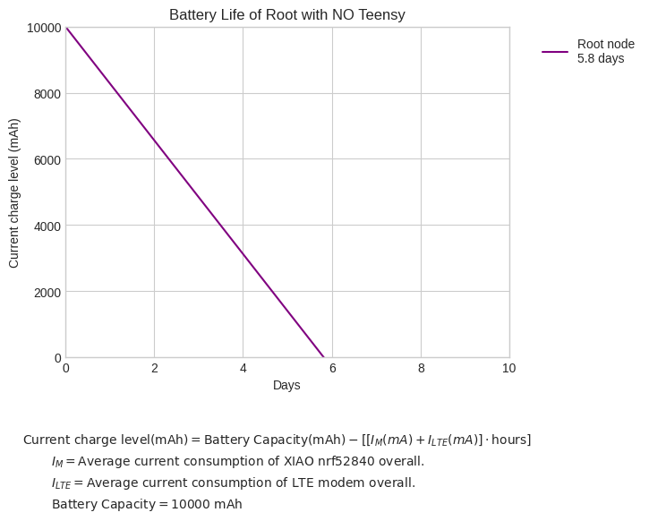

<h1>nRF52840 OpenWSN Sensor Node</h1>

<ul>
  <li><a href="#project-overview">Project Overview</a>
    <ul>
      <li><a href="#current-software-status">Current Software Status</a></li>
      <li><a href="#current-hardware-status">Current Hardware Status</a></li>
    </ul>
  </li>
  <li><a href="#battery-life-analysis">Battery Life Analysis</a>
    <ul>
      <li><a href="#data-logger-node">Data Logger Node</a></li>
      <li><a href="#root-node">Root Node</a></li>
    </ul>
  </li>
  <li><a href="#guide-for-openwsn-on-xiao-nrf52840">Guide for OpenWSN on XIAO nRF52840</a>
    <ul>
      <li><a href="#uart-communication-with-openwsn-on-xiao-nrf52840">UART Communication with OpenWSN on XIAO nRF52840</a></li>
      <li><a href="#adc-driver-for-nrf52-saadc-xiao-nrf52840">ADC Driver for nRF52 SAADC (XIAO nRF52840)</a></li>
      <li><a href="#openwsn-adc-reader-application">OpenWSN ADC Reader Application</a></li>
    </ul>
  </li>
</ul>

<h1 id="project-overview">Project Overview</h1>

This project builds upon the foundation of the <a href="https://github.com/mmontee/West_Lab_Hydrophone_Data_Logger">West_Lab_Hydrophone_Data_Logger</a>. The initial objective was to integrate the nRF52840 into the existing hardware architecture, with the long-term goal of migrating all signal processing tasks from the Teensy 4.0 to the nRF52840. This consolidation of processing onto a single microcontroller is expected to yield significant power savings while decreasing the complexity, size, and cost of each sensor node.

The ultimate aim is to create a wireless acoustic sensor network using the <a href="https://wiki.seeedstudio.com/XIAO_BLE/">XIAO nRF52840</a> and <a href="https://openwsn.org/">OpenWSN</a>. In the current transitional phase, a <a href="https://www.pjrc.com/store/teensy40.html">Teensy 4.0</a> with a <a href="https://www.pjrc.com/store/teensy3_audio.html">Teensy Audio Adaptor Board</a> captures and processes acoustic signals, and samples are saved to an SD card. The output is passed through the wireless network to a central root node. This root node does not perform sensing; instead, it passes information to an LTE-M modem, which uses MQTT to send the processed data to a cloud storage solution.

A critical aspect of the final transition will be to incorporate appropriate signal conditioning hardware to replace the functionality of the Teensy Audio Adaptor Board.

  

<h3 id="current-software-status">Current Software Status</h3>

<h4>Complete:</h4>
<ul>
  <li><strong>Hardware Programming</strong>: Established a method to program the device with OpenWSN.</li>
  <li><strong>Port OpenWSN to XIAO</strong>: Modified the existing OpenWSN project for the nRF52840-DK to support the XIAO.</li>
  <li><strong>Modified Openserial Driver</strong>: Adapted the openserial driver to enable UART communication between the Teensy and the nRF52840.</li>
  <li><strong>ADC Driver</strong>: Developed a dedicated ADC driver for the nRF52840's SAADC peripheral.</li>
  <li><strong>ADC Application</strong>: Created a sample application to demonstrate the driver's functionality and provide a foundation for future signal processing work.</li>
</ul>

<h4>Incomplete:</h4>
<ul>
  <li><strong>Signal Capture and Processing on nRF52840</strong>: Expand the ADC application to capture and process a time series of samples directly on the XIAO nrf52840.</li>
  <li><strong>Teensy4.0 openWSB output parse program</strong>: Procure new LTE-M modem and continue testing/development.</li>
</ul>

<h3 id="current-hardware-status">Current Hardware Status</h3>
<h4>Complete:</h4>
<ul>
  <li>Each sensor node consists of a custom PCB that interfaces the XIAO nRF52840, Teensy boards, RTC battery, a battery management board, and various I/O.</li>
  <li>A root node adds an LTE-M modem in the form of a <a href="https://sequans.com/products/monarch-2-gm02sp-nektar-evk/">Sequans Communications Monarch 2 GM02SP Evaluation Kit</a>, which sends data to a central location.</li>
</ul>

  
   
  The existing West Lab Hydrophone Data Logger PCB.

  
   
  The existing West Lab Hydrophone Data Logger with an LTE-M modem.

<ul>
  <li>Shown below is the "West_Lab_Hydrophone_Data_Logger" PCB modified to include the XIAO nRF52840.</li>
</ul>

  

<h4>Incomplete:</h4>
<ul>
  <li>A new PCB revision that incorporates signal conditioning hardware and removes the Teensy 4.0 and its audio adapter board.</li>
</ul>

<h2 id="battery-life-analysis">Battery Life Analysis</h2>
 
<ul>
<li>This section uses average current consumption measurements made with a <a href="https://www.joulescope.com/">JouleScope</a> to estimate battery life.</li>
<li>Current consumption measurements were generated by attaching the JouleScope and allowing a device to run in a particular mode for over one minute. The resulting statistical average current consumption generated by the JouleScope software was recorded.</li>
</ul>

<h3 id="data-logger-node">Data Logger Node</h3>

  
   
  Battery life estimates for the data logger without the XIAO nRF52840.

  
   
  Battery life estimates for the data logger with the XIAO nRF52840.

  
   
  Battery life estimates for a data logger with only the XIAO nRF52840 (Teensy 4.0 and Audio Adaptor Board removed).

<h3 id="root-node">Root Node</h3> 

  
   
  Battery life estimates for the root node without a Teensy 4.0.

  
   
  Battery life estimates for the root node with a Teensy 4.0.

<h2 id="guide-for-openwsn-on-xiao-nrf52840">Guide for OpenWSN on XIAO nRF52840</h2>

Fortunately, foundational work has been completed in OpenWSN's nRF52840-DK implementation, which can be found in the <a href="https://github.com/openwsn-berkeley/openwsn-fw/tree/develop_FW-893">develop_FW-893 branch</a>. In this project, the <a href="https://www.nordicsemi.com/Products/Development-hardware/nRF52840-DK">nRF52840-DK</a> is used as a programmer and debugger for the XIAO nRF52840 board.

This guide will step through the processes of:

<ul>
  <li>Configuring the existing OpenWSN project for the XIAO nRF52840's pinout.</li>
  <li>Using the nRF52840-DK to program and debug the XIAO nRF52840.</li>
  <li>Using UART to transmit information to and from an OpenWSN application.</li>
</ul>

This guide assumes you have the following hardware:

<ul>
  <li>XIAO nRF52840 development board</li>
  <li>Nordic Semiconductor nRF52840-DK</li>
  <li><a href="https://wiki.seeedstudio.com/Seeeduino-XIAO-Expansion-Board/">Seeed Studio Expansion Base for XIAO</a> or the ability to solder jumper wires to the XIAO nRF52840.</li>
</ul>

<h3>Software Setup</h3>
<ol>
  <li>
    <strong>Install Segger Embedded Studio for ARM (Legacy) V6.30.</strong> 
    <a href="https://www.segger.com/downloads/embedded-studio/#ESforARM">https://www.segger.com/downloads/embedded-studio/#ESforARM</a>
    

  </li>
  <li>
    <strong>Clone the OpenWSN firmware repository:</strong> 
    <code>git clone https://github.com/openwsn-berkeley/openwsn-fw</code>
  </li>
  <li>
    <strong>Switch to the correct branch:</strong> 
    <code>git checkout develop_FW-893</code>
    

  </li>
  <li>
    <strong>Navigate to the project folder:</strong> 
    <code>cd openwsn-fw/projects/nrf52840-DK/</code>
  </li>
  <li>
    <strong>Open the project file:</strong> <code>nrf52840_dk.emProject</code> 
    The project should open in the Segger Embedded Studio IDE installed in the first step.
    

  </li>
</ol>

<h3>Connecting the XIAO nRF52840 to the nRF52840-DK</h3>

Programming is done via the JTAG/SWD interface on the nRF52840-DK, which is exposed through the onboard J-Link debugger.

<ul>
  <li>Both boards must share a common ground reference.</li>
  <li>Power must be provided to both boards (in this guide, the nRF52840-DK powers the XIAO nRF52840).</li>
  <li>Connect SWD CLK.</li>
  <li>Connect SWD IO.</li>
  <li>Connect the jumper to enable the onboard debugger.</li>
</ul>

The connections are illustrated below.

We created the necessary connections using two methods:

<ol>
  <li>
    <strong>Using the "Expansion Board Base for XIAO":</strong> This board provides pogo pin contacts for the XIAO nRF52840's SWD pads, simplifying the connection process.
    

  </li>
  <li>
    <strong>Soldering wires directly:</strong> Alternatively, wire leads can be soldered to the XIAO nRF52840's SWD pads. The leads can then be connected directly to the nRF52840-DK as shown below.
    

  </li>
</ol>

<h3>Modifying OpenWSN for the XIAO nRF52840</h3>

Two changes must be made to the firmware to configure it for the XIAO nRF52840 platform: the UART and LED pin assignments must be updated.

<ol>
  <li>
    The UART pin assignments are found in <code>bsp/uart.c</code>. The image below shows the correct values for the XIAO nRF52840.
    

  </li>
  <li>
    The LED pin assignments must be changed in <code>bsp/leds.c</code>. The image below shows the correct values for the XIAO nRF52840.
    

    Reference the schematic for LED pin assignments:
    

  </li>
</ol>

<h3>Programming the XIAO nRF52840</h3>

Assuming the necessary connections are established between the XIAO nRF52840 and the nRF52840-DK:

<ol>
  <li>
    Set <code>03oos_openwsn</code> as the active project by right-clicking its name in the "Project Explorer".
    

  </li>
  <li>
    Compile the project: <strong>Build -> Build 03oos_openwsn</strong>.
    

  </li>
  <li>
    Program the device: <strong>Target -> Connect J-Link</strong>, then <strong>Target -> Download 03oos_openwsn</strong>.
    

  </li>
</ol>

<h2 id="uart-communication-with-openwsn-on-xiao-nrf52840">Guide for UART Communication with OpenWSN on XIAO nRF52840</h2>

This project modifies <code>openserial.c</code> to execute functions when specific UART messages are received. Sensor nodes receive processed signal information from an external source (like the Teensy) and pass this data to the root node. The root node's UART output is then parsed by another device.

Incoming UART messages are parsed within <code>openserial.c</code> using a set of flags from <code>openhdlc.h</code> and command characters (<code>cmdByte</code>) defined in <code>openserial.h</code>, as shown below.

  Flags 
  

  cmdBytes 
  

Valid messages must be preceded by an <code>HDLC_FLAG</code>, begin with a valid command byte, contain the payload, and be terminated with a second <code>HDLC_FLAG</code>.

A message coming into openserial should have the form: 
<code>&lt;HDLC_FLAG&gt;&lt;cmdByte&gt;&lt;payload&gt;&lt;HDLC_FLAG&gt;</code>

We send information into the node using the following format, where <code>'~'</code> is the <code>HDLC_FLAG</code>, <code>'D'</code> is the <code>cmdByte</code>, and <code>'1234567890'</code> is example data: 
Example: <code>~D1234567890~</code>

After a valid message is parsed, it is passed to a switch statement that acts on the received <code>cmdByte</code>. This byte triggers a specific action. Below, the code passes the incoming data as that action or does nothing if the node is the root.

  

Once the data is on the data bus, it can be read by a custom application (e.g., `uinject`) that will create a UDP packet containing the data to be passed over the network.

<h2 id="adc-driver-for-nrf52-saadc-xiao-nrf52840">ADC Driver for nRF52 SAADC (XIAO nRF52840)</h2>

<h3>1. Overview</h3>

This document describes a low-level driver for the nRF52 Successive-Approximation Analog-to-Digital Converter (SAADC) peripheral. The driver is designed for simplicity and provides a blocking (synchronous) API for single-channel ADC conversions.

It is specifically tailored with pin definitions corresponding to the analog pins on the <strong>Seeed Studio XIAO nRF52840</strong> board but can be adapted for other nRF52-based hardware.

<h4>Key Features</h4>
<ul>
  <li><strong>Easy Configuration</strong>: Uses a single configuration structure (<code>adc_config_t</code>) to set all major parameters.</li>
  <li><strong>Blocking Sampling</strong>: The <code>adc_sample()</code> function waits for the conversion to complete before returning, simplifying application logic.</li>
  <li><strong>Hardware Abstraction</strong>: Maps XIAO nRF52840 pin names (A0-A5) to the correct nRF52 AIN inputs.</li>
  <li><strong>Configurable Parameters</strong>:
    <ul>
      <li>Resolution (8, 10, 12, 14-bit)</li>
      <li>Hardware Oversampling (up to 256x)</li>
      <li>Reference Voltage (Internal 0.6V or VDD/4)</li>
      <li>Input Gain (1/6x to 4x)</li>
      <li>Acquisition Time (3µs to 40µs)</li>
    </ul>
  </li>
  <li><strong>Automatic Calibration</strong>: Performs an automatic offset calibration during initialization to improve accuracy.</li>
</ul>

<h3>2. API Reference</h3>

The driver exposes three main functions for controlling the ADC.

<h4><code>void adc_init(const adc_config_t* config)</code></h4>

Initializes the SAADC peripheral with the specified settings. This function must be called before any sampling can occur.

<ul>
  <li><strong>Description</strong>: Configures the ADC resolution, oversampling, channel settings (pin, gain, reference, acquisition time), performs an offset calibration, and enables the peripheral.</li>
  <li><strong>Parameters</strong>:
    <ul>
      <li><code>config</code>: A pointer to a constant <code>adc_config_t</code> structure containing the desired ADC settings.</li>
    </ul>
  </li>
</ul>

<h4><code>bool adc_sample(uint16_t* result)</code></h4>

Performs a single, blocking ADC conversion on the channel configured during initialization.

<ul>
  <li><strong>Description</strong>: This function starts the ADC, triggers a sample, and waits for the <code>EVENTS_END</code> interrupt flag. It then copies the conversion result from the internal buffer to the user-provided location. To save power, it stops the ADC after the sample is complete.</li>
  <li><strong>Warning</strong>: This function blocks program execution until the conversion is complete.</li>
  <li><strong>Parameters</strong>:
    <ul>
      <li><code>result</code>: A pointer to a <code>uint16_t</code> variable where the ADC conversion result will be stored. The value's range depends on the configured resolution (e.g., 0-1023 for 10-bit).</li>
    </ul>
  </li>
  <li><strong>Returns</strong>:
    <ul>
      <li><code>true</code>: If the conversion was successful.</li>
      <li><code>false</code>: If the ADC was not initialized or the <code>result</code> pointer is NULL.</li>
    </ul>
  </li>
</ul>

<h4><code>void adc_uninit(void)</code></h4>

Disables and powers down the SAADC peripheral to save energy.

<ul>
  <li><strong>Description</strong>: Stops any ongoing conversions, disables the peripheral, and resets channel configurations. An <code>adc_init()</code> call is required before any new samples can be taken.</li>
</ul>

<h3>3. Configuration</h3>

Configuration is handled via the <code>adc_config_t</code> struct and several <code>enum</code> types.

<h4><code>adc_config_t</code> Structure</h4>

This structure holds all the necessary parameters for the <code>adc_init</code> function.

<pre><code class="language-c">
typedef struct {
    adc_resolution_t       resolution;
    adc_oversample_t       oversample;
    adc_reference_t        reference;
    adc_gain_t             gain;
    adc_acqtime_t          acq_time;
    adc_analog_input_pin_t pin;
} adc_config_t;
</code></pre>

<h4>Configuration Enums</h4>

<h5><code>adc_analog_input_pin_t</code></h5>

Selects the physical analog input pin on the XIAO nRF52840.

<table>
  <thead>
    <tr>
      <th>Enum Value</th>
      <th>XIAO Pin</th>
      <th>nRF52 Pin</th>
      <th>nRF52 AIN</th>
    </tr>
  </thead>
  <tbody>
    <tr>
      <td><code>ADC_PIN_A0</code></td>
      <td>A0</td>
      <td>P0.02</td>
      <td>AIN0</td>
    </tr>
    <tr>
      <td><code>ADC_PIN_A1</code></td>
      <td>A1</td>
      <td>P0.03</td>
      <td>AIN1</td>
    </tr>
    <tr>
      <td><code>ADC_PIN_A2</code></td>
      <td>A2</td>
      <td>P0.28</td>
      <td>AIN4</td>
    </tr>
    <tr>
      <td><code>ADC_PIN_A3</code></td>
      <td>A3</td>
      <td>P0.29</td>
      <td>AIN5</td>
    </tr>
    <tr>
      <td><code>ADC_PIN_A4</code></td>
      <td>A4</td>
      <td>P0.04</td>
      <td>AIN2</td>
    </tr>
    <tr>
      <td><code>ADC_PIN_A5</code></td>
      <td>A5</td>
      <td>P0.05</td>
      <td>AIN3</td>
    </tr>
  </tbody>
</table>

<h5><code>adc_resolution_t</code></h5>

Sets the bit resolution of the conversion. Higher resolution provides more precision but takes longer.

<ul>
  <li><code>ADC_RESOLUTION_8BIT</code></li>
  <li><code>ADC_RESOLUTION_10BIT</code> (Common default)</li>
  <li><code>ADC_RESOLUTION_12BIT</code></li>
  <li><code>ADC_RESOLUTION_14BIT</code> (Requires acquisition time >= 10µs)</li>
</ul>

<h5><code>adc_oversample_t</code></h5>

Enables hardware averaging to reduce noise. The ADC takes multiple samples and averages them into a single result.

<ul>
  <li><code>ADC_OVERSAMPLE_DISABLED</code></li>
  <li><code>ADC_OVERSAMPLE_2X</code>, <code>_4X</code>, <code>_8X</code>, <code>_16X</code>, <code>_32X</code>, <code>_64X</code>, <code>_128X</code>, <code>_256X</code></li>
</ul>

<h5><code>adc_reference_t</code></h5>

Selects the voltage reference for the conversion.

<ul>
  <li><code>ADC_REFERENCE_INTERNAL</code>: Internal 0.6V reference.</li>
  <li><code>ADC_REFERENCE_VDD_DIV_4</code>: Uses VDD / 4 as the reference.</li>
</ul>

<h5><code>adc_gain_t</code></h5>

Sets the gain for the internal pre-amplifier. The total input voltage range is determined by <code>V_Reference / Gain</code>.

<table>
  <thead>
    <tr>
      <th>Enum Value</th>
      <th>Gain</th>
      <th>Input Range (with 0.6V VREF)</th>
      <th>Input Range (with VDD/4 VREF)</th>
    </tr>
  </thead>
  <tbody>
    <tr>
      <td><code>ADC_GAIN_1_6</code></td>
      <td>1/6x</td>
      <td>0 - 3.6V</td>
      <td>0 - 6.0V (e.g., if VDD=3.3V -> 0-4.95V)</td>
    </tr>
    <tr>
      <td><code>ADC_GAIN_1_5</code></td>
      <td>1/5x</td>
      <td>0 - 3.0V</td>
      <td>0 - 5.0V (e.g., if VDD=3.3V -> 0-4.125V)</td>
    </tr>
    <tr>
      <td><code>ADC_GAIN_1_4</code></td>
      <td>1/4x</td>
      <td>0 - 2.4V</td>
      <td>0 - 4.0V (e.g., if VDD=3.3V -> 0-3.3V)</td>
    </tr>
    <tr>
      <td><code>ADC_GAIN_1_3</code></td>
      <td>1/3x</td>
      <td>0 - 1.8V</td>
      <td>0 - 3.0V (e.g., if VDD=3.3V -> 0-2.475V)</td>
    </tr>
    <tr>
      <td><code>ADC_GAIN_1_2</code></td>
      <td>1/2x</td>
      <td>0 - 1.2V</td>
      <td>0 - 2.0V (e.g., if VDD=3.3V -> 0-1.65V)</td>
    </tr>
    <tr>
      <td><code>ADC_GAIN_1</code></td>
      <td>1x</td>
      <td>0 - 0.6V</td>
      <td>0 - 1.0V (e.g., if VDD=3.3V -> 0-0.825V)</td>
    </tr>
    <tr>
      <td><code>ADC_GAIN_2</code></td>
      <td>2x</td>
      <td>0 - 0.3V</td>
      <td>0 - 0.5V (e.g., if VDD=3.3V -> 0-0.4125V)</td>
    </tr>
    <tr>
      <td><code>ADC_GAIN_4</code></td>
      <td>4x</td>
      <td>0 - 0.15V</td>
      <td>0 - 0.25V (e.g., if VDD=3.3V -> 0-0.206V)</td>
    </tr>
  </tbody>
</table>

  <strong>Note:</strong> The actual input voltage range is limited by VDD. For example, with <code>ADC_GAIN_1_6</code> and VDD at 3.3V, the effective input range is 0V to 3.3V. <strong>The most common setting for measuring a voltage from 0 to VDD (e.g., 3.3V) is to use <code>ADC_REFERENCE_INTERNAL</code> and <code>ADC_GAIN_1_6</code>.</strong>

<h5><code>adc_acqtime_t</code></h5>

Sets the acquisition time for the sample-and-hold capacitor. Longer times are needed for high-impedance sources.

<ul>
  <li><code>ADC_ACQTIME_3US</code></li>
  <li><code>ADC_ACQTIME_5US</code></li>
  <li><code>ADC_ACQTIME_10US</code></li>
  <li><code>ADC_ACQTIME_15US</code></li>
  <li><code>ADC_ACQTIME_20US</code></li>
  <li><code>ADC_ACQTIME_40US</code></li>
</ul>

<h3>4. Usage Example</h3>

Here is a complete example of how to initialize, configure, and read from an analog pin.

<pre><code class="language-c">
#include "adc.h"
#include &lt;stdio.h&gt; // For printing

int main(void) {
    // 1. Configure the ADC
    // This example configures the ADC to read a voltage between 0-3.6V
    // on pin A0 with 10-bit resolution.
    const adc_config_t my_adc_config = {
        .resolution = ADC_RESOLUTION_10BIT,
        .oversample = ADC_OVERSAMPLE_4X,      // Use 4x oversampling for better stability
        .reference  = ADC_REFERENCE_INTERNAL, // Use internal 0.6V reference
        .gain       = ADC_GAIN_1_6,           // Use 1/6 gain (effective input range is 0.6V * 6 = 3.6V)
        .acq_time   = ADC_ACQTIME_10US,
        .pin        = ADC_PIN_A0
    };

    // 2. Initialize the ADC
    adc_init(&my_adc_config);

    // 3. Main loop to sample the ADC
    while (1) {
        uint16_t adc_raw_value;

        // Take a sample
        if (adc_sample(&adc_raw_value)) {
            // Success! `adc_raw_value` contains the result (e.g., 0-1023 for 10-bit)

            // Optional: Convert raw value to millivolts
            // V_in_mV = (adc_raw_value / 1024.0) * 3600.0
            float voltage_mv = (float)adc_raw_value * (3600.0f / 1024.0f);

            // Print the result (assuming a UART or RTT is set up)
            printf("ADC Raw: %u, Voltage: %.2f mV\n", adc_raw_value, (double)voltage_mv);

        } else {
            // Handle error (e.g., ADC not initialized)
            printf("ADC sample failed.\n");
        }

        // Delay between samples
        for (volatile int i = 0; i < 1000000; i++);
    }

    // 4. Uninitialize (optional, typically not reached in a main loop)
    // adc_uninit();
}
</code></pre>

<h1 id="openwsn-adc-reader-application">OpenWSN ADC Reader Application</h1>

<h3>1. Overview</h3>

This document describes <code>adcread</code>, a simple application component for the OpenWSN operating system. Its purpose is to periodically read an analog sensor using the <code>adc</code> driver and make the latest reading available to other parts of the system.

The application integrates with the OpenWSN kernel's <code>opentimers</code> service to schedule non-blocking, periodic ADC sampling. This makes it an efficient, low-power way to monitor a sensor.

<h4>Key Features</h4>
<ul>
  <li><strong>OpenWSN Integration</strong>: Built as a standard OpenWSN component that uses the kernel's timer service for scheduling.</li>
  <li><strong>Periodic Sampling</strong>: Automatically reads the configured ADC channel every 5 seconds (<code>ADC_READER_PERIOD_MS</code>).</li>
  <li><strong>Non-blocking API</strong>: Provides a simple, non-blocking function (<code>adcread_get_value()</code>) for other modules to retrieve the latest sensor data.</li>
  <li><strong>Power Efficient</strong>: The application is designed not to run on the DAGroot to save energy on the most critical node in the network.</li>
  <li><strong>Driver Abstraction</strong>: Uses the underlying <code>adc</code> peripheral driver, separating the application logic from the hardware-specific details.</li>
</ul>

<h3>2. API Reference</h3>

The <code>adcread</code> application exposes two public functions.

<h4><code>void adcread_init(void)</code></h4>
<ul>
  <li><strong>Description</strong>: This function configures and initializes the underlying <code>adc</code> driver with static settings defined within <code>adcread.c</code>. It then creates and schedules a periodic timer that will trigger an ADC reading.</li>
  <li><strong>Warning</strong>: This function must be called <em>after</em> <code>opentimers_init()</code> has been successfully executed.</li>
</ul>

<h4><code>uint16_t adcread_get_value(void)</code></h4>
<ul>
  <li><strong>Description</strong>: This is a non-blocking function that immediately returns the most recent ADC value stored by the periodic timer task. It does not trigger a new ADC reading.</li>
  <li><strong>Returns</strong>: A <code>uint16_t</code> representing the latest raw ADC conversion result.</li>
</ul>

<h3>3. Configuration</h3>

Unlike the driver, the application's configuration is hard-coded within the <code>adcread.c</code> file for simplicity. To change these settings, you must edit the source file and recompile.

<h4>Default ADC Configuration</h4>

The following settings are applied in <code>adcread_init()</code>:

<pre><code class="language-c">
// Statically defined configuration within adcread.c
adcread_vars.adc_config.resolution = ADC_RESOLUTION_12BIT;
adcread_vars.adc_config.oversample = ADC_OVERSAMPLE_DISABLED;
adcread_vars.adc_config.reference  = ADC_REFERENCE_INTERNAL; // 0.6V reference
adcread_vars.adc_config.gain       = ADC_GAIN_1_6;          // Input range = 0.6V / (1/6) = 3.6V
adcread_vars.adc_config.acq_time   = ADC_ACQTIME_10US;
adcread_vars.adc_config.pin        = ADC_PIN_A0;             // Reads from XIAO pin A0
</code></pre>

<h4>Sampling Period</h4>

The sampling rate is controlled by a preprocessor macro:

<pre><code class="language-c">
// Defines the period for reading the ADC in milliseconds
#define ADC_READER_PERIOD_MS 5000 // Read ADC every 5 seconds
</code></pre>

<h3>4. Integration with OpenWSN</h3>

Here is how to integrate and use the <code>adcread</code> application within the OpenWSN framework.

<h4>1. Initialization</h4>

Call <code>adcread_init()</code> from the main system initialization function (e.g., in <code>openwsn.c</code>'s <code>openwsn_init</code> function), ensuring it is called after the kernel services are available.

<pre><code class="language-c">
// In openwsn.c or your main application file
#include "adcread.h"

void openwsn_init(void) {
    // ... other initializations
    board_init();
    scheduler_init();
    opentimers_init();
    // ... other initializations

    // Initialize the ADC reader application
    adcread_init();

    // ... more initializations
    scheduler_start();
}
</code></pre>

<h4>2. Retrieving Data</h4>

Other application modules (e.g., a data packet creation module like `C6T` or a custom application) can get the latest sensor data by calling <code>adcread_get_value()</code>.

<pre><code class="language-c">
// Example in another module that needs the sensor data
#include "adcread.h"

void send_sensor_data_task(void) {
    uint16_t sensor_value;

    // Get the latest value from the ADC reader app
    sensor_value = adcread_get_value();

    // Now, 'sensor_value' can be added to a packet payload
    // to be sent over the 6LoWPAN network.
    // ...
}
</code></pre>

<h4>3. Component ID</h4>

For error logging via <code>openserial_printLog</code>, ensure that <code>COMPONENT_ADCREAD</code> is defined in the <code>opendefs.h</code> file alongside other component IDs.

<h3>5. Advanced Usage: Time-Series Sampling (Blocking Method)</h3>

For certain applications, you might need to capture a rapid burst of samples. The following method uses a <strong>blocking loop</strong> to monopolize the CPU and capture samples as fast as the hardware allows, without yielding control to the OpenWSN scheduler.

    Using a blocking loop in a cooperative OS like OpenWSN is dangerous and should be handled with extreme care.

<ul>
    <li><b>Processor Hogging</b>: The loop will prevent <b>all</b> other tasks from running, including the OpenWSN scheduler and the 6TiSCH network stack.</li>
    <li><b>Network Instability</b>: If the total time spent in the blocking loop is longer than a network timeslot (typically a few milliseconds), the node will fail to communicate. This can cause it to lose synchronization with the network, leading to packet loss or complete disconnection.</li>
    <li><b>When to Use</b>: This method is only acceptable for <strong>very short bursts</strong> where the total capture time is guaranteed to be minimal (e.g., less than one millisecond). For any longer duration, a non-blocking, task-based approach is required to maintain system stability.</li>
</ul>

<h4>Capturing a Burst with a Blocking Loop</h4>

This is achieved by creating a function that enters a tight `for` loop, calling `adc_sample()` in each iteration.

<strong>1. Define buffer and state variables:</strong> 
First, define the buffer size in <code>adcread.c</code> and add necessary state variables to `adcread_vars_t`.

<pre><code class="language-c">
// adcread.c
#define ADC_BURST_BUFFER_SIZE 256 // Capture 256 samples per burst

typedef struct {
    opentimers_id_t timer_id;
    uint16_t        latest_adc_value;
    adc_config_t    adc_config;
    bool            initialized;
    // --- New variables for burst mode ---
    uint16_t        burst_buffer[ADC_BURST_BUFFER_SIZE]; // Buffer for samples
    bool            burst_in_progress;                   // Flag to prevent re-entrant calls
} adcread_vars_t;
</code></pre>

<strong>2. Create the blocking capture function:</strong> 
This function will contain the blocking loop. After the capture is complete, it schedules a separate, non-blocking task to process the data, which is a safer way to handle potentially long computations.

<pre><code class="language-c">
// adcread.c -- function prototypes
void _adcread_process_task_cb(void); // Task to process data after capture
void adcread_capture_burst_blocking(void); // Public function to initiate a burst

// Public function with the blocking capture loop
void adcread_capture_burst_blocking(void) {
    if (!adcread_vars.initialized || adcread_vars.burst_in_progress) {
        return; // Exit if not ready or another burst is active
    }
    adcread_vars.burst_in_progress = true;

    // Stop the periodic timer to prevent interference
    opentimers_stop(adcread_vars.timer_id);

    // --- START OF BLOCKING SECTION ---
    // This loop takes full control of the CPU. No other tasks will run.
    for (uint16_t i = 0; i < ADC_BURST_BUFFER_SIZE; i++) {
        adc_sample(&adcread_vars.burst_buffer[i]);
    }
    // --- END OF BLOCKING SECTION ---

    // Now that the time-critical capture is done, schedule a
    // non-blocking task to process the data.
    scheduler_push_task(_adcread_process_task_cb, TASKPRIO_ADC);

    adcread_vars.burst_in_progress = false;

    // Restart the periodic timer for normal operation
    opentimers_scheduleIn(
        adcread_vars.timer_id,
        ADC_READER_PERIOD_MS,
        TIME_MS,
        TIMER_PERIODIC,
        _adcread_timer_cb
    );
}
</code></pre>

<h4>On-Mote Data Processing</h4>

Sending a large buffer of raw samples over the network is inefficient. Processing the data on the mote first and transmitting only the result reduces network traffic and saves energy. The `_adcread_process_task_cb` function is the ideal place for this computation, as it runs as a standard, non-blocking OpenWSN task.

<strong>Example Processing Task:</strong>

<pre><code class="language-c">
// adcread.c -- processing task
void _adcread_process_task_cb(void) {
    uint32_t sum = 0;
    uint16_t min_val = 0xFFFF;
    uint16_t max_val = 0x0000;

    // Iterate through the collected samples
    for (int i = 0; i < ADC_BURST_BUFFER_SIZE; i++) {
        uint16_t sample = adcread_vars.burst_buffer[i];
        sum += sample;

        if (sample < min_val) {
            min_val = sample;
        }
        if (sample > max_val) {
            max_val = sample;
        }
    }

    // Calculate the average
    uint16_t average_val = (uint16_t)(sum / ADC_BURST_BUFFER_SIZE);

    // Store the processed result in the main variable
    // This makes it available via the standard adcread_get_value() function
    adcread_vars.latest_adc_value = average_val;

    // For debugging, you could print the results
    // openserial_printf("Burst processed: Avg=%d, Min=%d, Max=%d\r\n", average_val, min_val, max_val);
}
</code></pre>