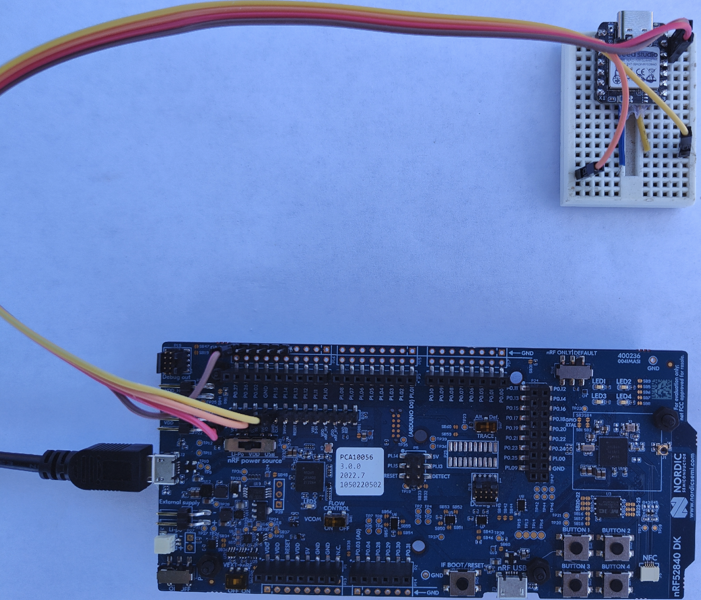

# nrf52840_openWSN_sensor_node</br>

- [Introduction](#introduction)

- [Guide for OpenWSN on XIAO-nrf52840](#Guide-for-OpenWSN-on-XIAO-nrf52840)

- [Guide for UART communication with openWSB on XIAO-nrf5280](#Guide-for-UART-communication-with-openWSB-on-XIAO-nrf5280)

<h2>Introduction</h2>


This project's goal is to implement an wireless acoustic sensor network using the [XIAO-nrf52840](https://wiki.seeedstudio.com/XIAO_BLE/) and [openWSN](https://openwsn.org/). Acoustic signals samples are captured and processed using a [Teensy4.0](https://www.pjrc.com/store/teensy40.html)  and the [Teensy Audio Adaptor Board](https://www.pjrc.com/store/teensy3_audio.html) . Samples are stored on removable flash memory(SD card). The output of that processing is passed through the wireless network to a central "root" device for further processing.</br>


<p align="center">

</p>


Every node consists for a custom PCB that interfaces the XIAO-nrf52840, Teensy boards, RTC bettery, battery management board, and various I/O. </br>


<p align="center">

</p>

A root node add a LTE-M modem in the form of a [Sequans communications Monarch 2 GM02SP Evaluation Kit](https://sequans.com/products/monarch-2-gm02sp-nektar-evk/) that is used to send data to a cental location.

<p align="center">

</p>


---
</br>
</br>
<h2>Guide for OpenWSN on XIAO-nrf52840</h2>

Luckily the work has been done through openWSN's nrf52840-DK implementation that can be found [here](https://github.com/openwsn-berkeley/openwsn-fw/tree/develop_FW-893). </br>

In this project the [nrf52840-DK](https://www.nordicsemi.com/Products/Development-hardware/nRF52840-DK) is used to provide a method for programming and debugging the XIAO-nrf5280 dev board.</br>

This guide will step through the processes of:
* Configuring the existing work for a new set of pins
* How to use the nrf52840-DK to program/de-bug the XIAO-nrf52840
* How to use UART connections to get information in and out of openWSN.

For this guide you are expected to have: </br>
* XIAO-nrf52840 Development board </br>
* Nordic Semi nrf52840-DK </br>
* [SEEED STUDIO EXPANSION BASE XIAO](https://wiki.seeedstudio.com/Seeeduino-XIAO-Expansion-Board/) or the ability to solder small jumper wires to the XIAO-nrf52840 </br>

---
</br>
</br>

<h3>Software Set-up</h3>

1. Install Segger Embedded Studio for ARM (legacy) V6.30.</br>

 https://www.segger.com/downloads/embedded-studio/#ESforARM </br>


<p align="center">

</p>


2.  Clone the openWSN openwsn-fw : https://github.com/openwsn-berkeley/openwsn-fw</br> 

3.  Switch to the branch - "develop_FW-893" </br>
<p align="center">

</p>


4. Navigate to the folder

```openwsn-fw/projects/nrf52840-DK/```

5. Open the projet file </br>

```nrf52840_dk.emProject```

The project should be opened by the Segger Embedded Studio installed in a previous step.</br>

<p align="center">

</p>

</br>
</br>

---
</br>
</br>

<h3>Connecting to the XIAO-nrf5280 to the nrf5280-DK</h3>

Programming is done through JTAG/SWD interface on the nrf52840-DK called "J-Link". 
* Both boards must share a ground reference
* Power must be provided to both(in our example the nrf52840-DK powers the XIAO-nrf5280) 
* Connect SWD CLK
* Connect SWD IO
* Connect Jumper

Below the connection are illustrated.
<p align="center">

</p>

We accomplished created the necessary connetions using two methods. </br>
1. The first using a "Expansion Board Base for XIAO". This board provides pogo pin contacts for the XIAO-nrf5280's SWD pads. </br>

<p align="center">

</p>
</br>
</br>

2. Alternativly wire leads can be soldered to the XIAO-nrf5280's SWD pads. The wire leads can then be direclty connected to the nrf52850-DK as shown below.
<p align="center">

</p>

---
</br>
</br>

<h3>Modifying openWSN for the XIAO-nrf5280</h3>

Two changes are made to the branch to configure for the XIAO-nrf5280 platform. The UART and LED pin assignments need to be changed. 

1.  The UART pin assignments are found /bsp/uart.c. The below image shows the collect vales for the XIAO-nrf5280. </br>

<p align="center">

</p>

2.  The LED pins need to be changed in /bsp/led.c. The below image shows the collect vales for the XIAO-nrf5280. </br>

<p align="center">

</p>

Reference schematic for LED assignment</br>

<p align="center">

</p>

---
</br>
</br>

<h3>Programming the XIAO-nrf5280</h3>

Assuming the necessary connections are establised between the XIAO-nrf5280 and the nrf5280-DK

Set openWSN as the active project by left clicking the project name withing the "Project Explorer"

<p align="center">

</p>

Compile -> Build-Build 03oos_openwsn</br>

<p align="center">

</p>


Program -> Target - Connect J-Link, Then Target - Download 03oos_openwsn</br>

<p align="center">

</p>

---
</br>
</br>

<h2>Guide for UART communication with openWSB on XIAO-nrf5280</h2>

This project modifies openserial.c to execute functions as UART messages are received. Nodes receive processed signal information and pass all data to the root node. The root node's UART output is parsed using a Teensy. </br>

In coming UART messages are parsed within openserial.c using a set of flags found in ```openhdlc.h``` and command characters named 'cmdByte' that are defined in ```openserial.h``` are shown below. </br>

<p align="center">
Flags</br>

</p>

<p align="center">
cmdBytes</br>

</p>

Valid messages are be proceeded by a HDLC_FLAG and begin with a valid flag, followed by the cmdByte, then the payload, and terminated with a second HDLC_FLAG</br> 

A message coming into openserial should have the form.</br>
```<HDLC_FLAG><cmdByte><payload><HDLC_FLAG> ```</br>

We send information into the node using the following form where ```'~'``` is the HDLC_FLAG, ```'D'``` as the cmdByte and ```'1234567890'``` is example information.</br>
EX. ```~D1234567890~```

After a valid message is parsed it is passed to a switch that acts on the received cmdByte. This byte will index a certain action. Below we pass the incoming data as that action or do nothing if we are root. </br>

<p align="center">

</p>

Once that data is in the data bus it can be read my the uniject app that will create a UDP packet containing the data that will be passed over the network.  


